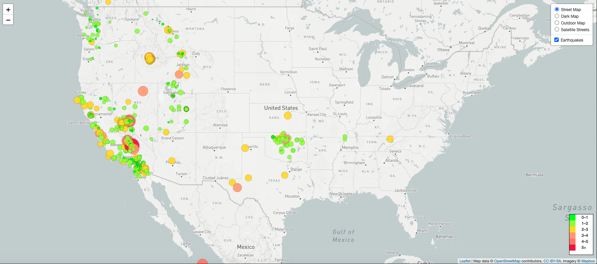
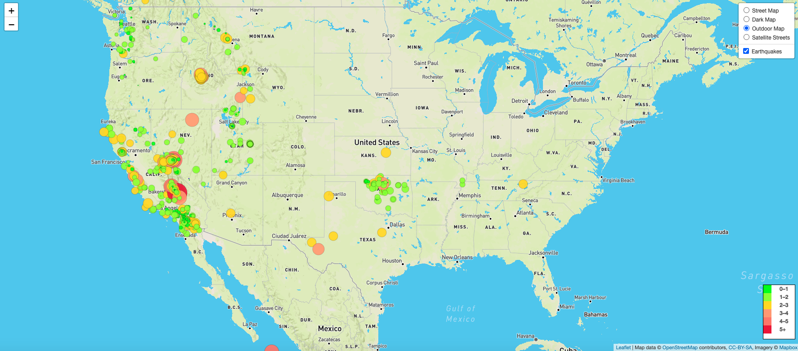
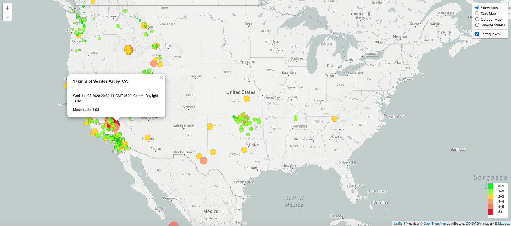
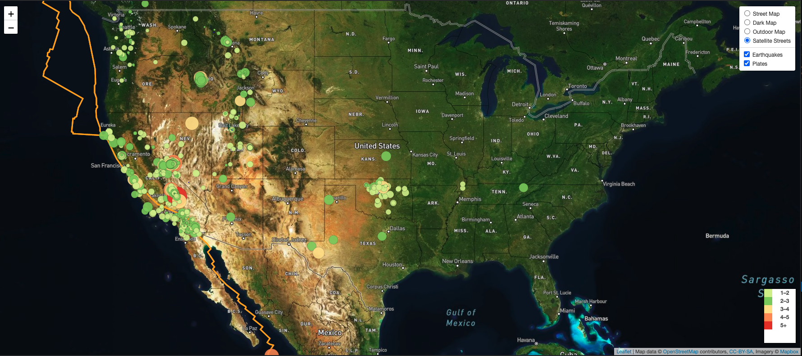

# Visualizing Data with Leaflet

## Background

The USGS (United States Geological Survey) is responsible for providing scientific data about natural hazards, the health of our ecosystems and environment; and the impacts of climate and land-use change. Their scientists develop new methods and tools to supply timely, relevant, and useful information about the Earth and its processes. 

This project builds a set of tools that will allow visualization of  earthquake data. USGS collects a massive amount of data from all over the world each day, this project provides a meaningful way of displaying it. 

### Repository Structure

1. This repository `leaflet-challenge`. 

2. Two folders to correspond to the challenges: **Leaflet-Step-1** and **Leaflet-Step-2**.

4. This project utilizes both **html** and **Javascript**. These will be the main files to run for analysis.

## Project Tasks

### Level 1: Basic Visualization

Thefirst task is to visualize an earthquake data set, as shown in the map above.

1. **Get your data set**

   

   The USGS provides earthquake data in a number of different formats, updated every 5 minutes. Visit the [USGS GeoJSON Feed](http://earthquake.usgs.gov/earthquakes/feed/v1.0/geojson.php) page and pick a data set to visualize. When you click on a data set, for example 'All Earthquakes from the Past 7 Days', you will be given a JSON representation of that data. You will be using the URL of this JSON to pull in the data for our visualization.

   

2. **Import & Visualize the Data**

   Create a map using Leaflet that plots all of the earthquakes from your data set based on their longitude and latitude.

   * Data markers reflect the magnitude of the earthquake in their size and color. Earthquakes with higher magnitudes appear larger and darker in color.

   * Popups provide additional information about the earthquake when a marker is clicked.

   * The legend provides context for the map data.

   * The visualization looks like the map below.  There are four views available and the pop up provide more information about the earthquake.

- - -

### Level 2: More Data (Optional)

This task plots a second data set on the map to illustrate the relationship between tectonic plates and seismic activity, pulling in a second data set and visualize it along side the original set of data. Data on tectonic plates can be found at <https://github.com/fraxen/tectonicplates>.

This step

* Plots a second data set on the map.

* Adds a number of base maps to choose from as well as separate out the two different data sets into overlays that can be turned on and off independently.

* Adds layer controls to the map as slown below. 

### Observations
An earthquake is the sudden movement of Earth's crust. Earthquakes generally occur along fault lines.  Fault lines are cracks in Earth's crust where tectonic plates meet (see image below). They occur where plates are subducting, spreading, slipping, or colliding. As the plates grind together, they get stuck and pressure builds up. Finally, the pressure between the plates is so great that they break loose. Depending on how much pressure has built up, the ground may tremble slightly or shake forcefully.

The tectonic plates divide the Earth's crust into distinct "plates" that are always slowly moving. Earthquakes are concentrated along these plate boundaries. <https://www.usgs.gov/natural-hazards/earthquake-hazards/science/science-earthquakes?qt-science_center_objects=0#qt-science_center_objects>

But not all earthquakes are powerful enough to cause damage. In fact, earthquakes are happening all the time, on land and in the ocean as shown in this challenge, which uses earthquake data for the past week. Most are so small that people don't even feel them.

The Richter Scale <https://en.wikipedia.org/wiki/Richter_magnitude_scale> measures the intensity of an earthquake on a scale of 1-10.  A magnitude greater than 6 on the Richter Scale is considered a major earthquake.  

- - -

### Copyright

Ann McNamara © 2020. All Rights Reserved.
